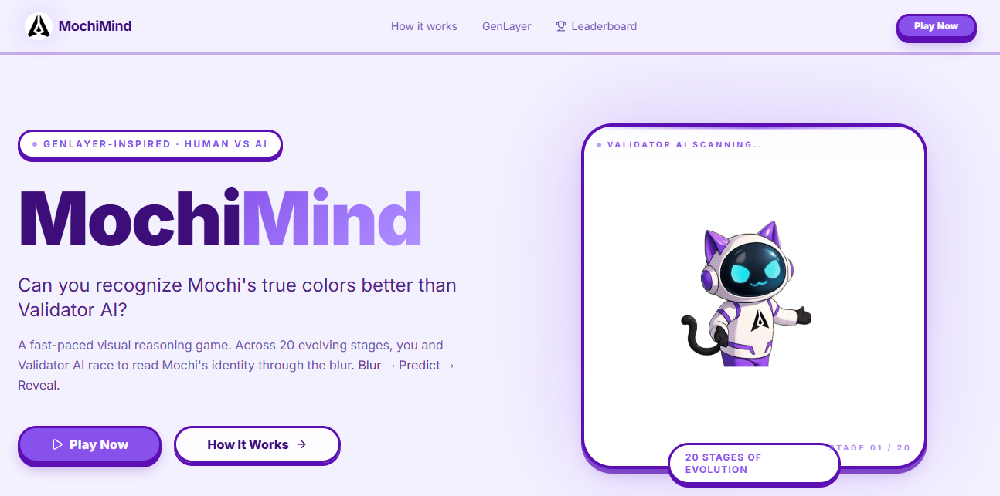
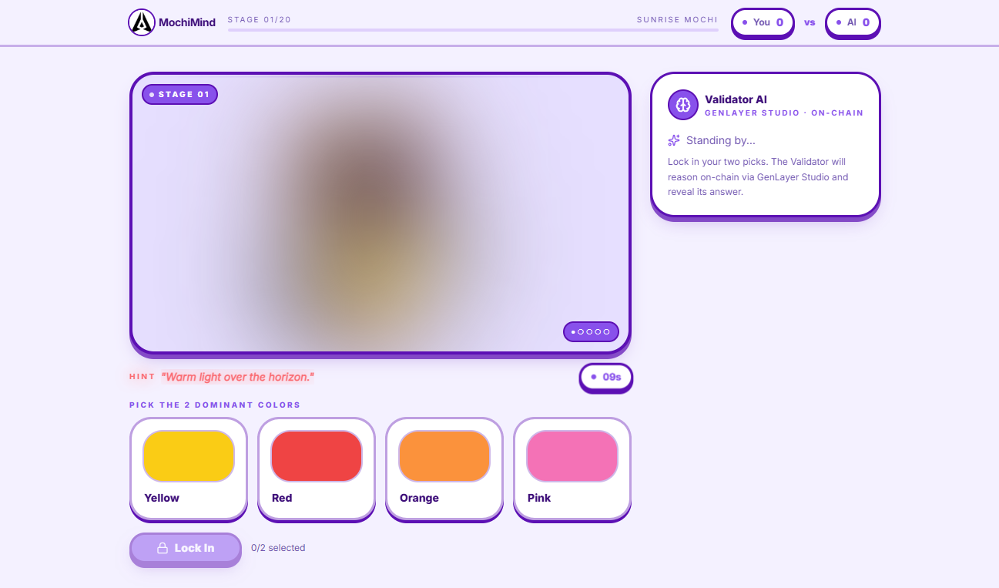
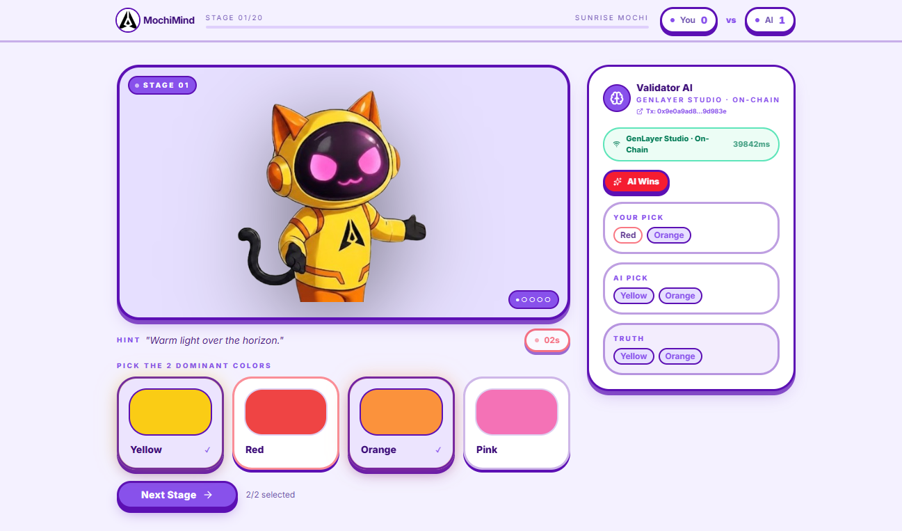

# MochiMind

> "See what AI sees… or better."

MochiMind is a GenLayer-powered perception game. A player looks at a blurred image
of a character called Mochi and picks the two colors that dominate it. A GenLayer
Intelligent Contract looks at **the same image** and decides, by validator
consensus, which two colors actually dominate.

Human intuition against on-chain AI consensus, over 20 evolving stages.

---

## The Intelligent Contract

**Source: [`contracts/MochiMindValidator.py`](./contracts/MochiMindValidator.py)** — in this
repository, in full. See [`contracts/README.md`](./contracts/README.md) for the design notes,
the equivalence principle, and deployment steps.

```text
Contract address:  <pending redeploy — will be added here>
Explorer:          https://explorer-studio.genlayer.com/address/<address>
Network:           GenLayer Studio (studionet)
```

> Studio validators must be configured with a **vision-capable model** (GPT-5,
> Claude Sonnet). A text-only validator cannot see the image and every round will fail.

### What the contract actually decides

"Which two colors dominate this image?" is a subjective visual judgment. There is no
deterministic API that answers it, and no single party who should be trusted to answer
it. That is the shape of problem GenLayer's Optimistic Democracy exists for.

The caller supplies **only** the stage number and the player's two picks:

```python
submit_pick(stage_id, player_picks)
```

That is the entire payload. The image URL and the candidate colors are registered
on-chain by the contract owner. Dominance is measured by a vision model looking at
the actual PNG bytes. The player cannot supply the image, the candidates, the
weights, or the answer.

### Trust boundary

| Owner | Responsibility |
|---|---|
| Frontend / backend | UI, blur animation, score display, leaderboard, and *submitting* the player's two picks |
| **This contract** | The stage registry (image URL + candidate colors), the vision judgment over the real image, the validator comparison rule, and the stored verdict |
| External source | The raw PNG bytes, which every validator re-fetches and re-examines independently |

---

## How a round works

```text
submit_pick(stage_id, player_picks)
        │
        ├─ look up the stage on-chain → image_url, candidate colors
        │
        ├─ LEADER      gl.nondet.web.get(image_url)      → raw PNG bytes
        │              verify PNG/JPEG magic bytes       → reject HTML error pages
        │              gl.nondet.exec_prompt(..., images=[png])
        │              normalize → coverage % per candidate, ranked
        │
        ├─ VALIDATORS  re-fetch the same image, re-run the same judgment,
        │              then compare decisions (not formatting)
        │
        ├─ consensus → final_colors  (ground truth for the round)
        ├─ derive    → ai_colors     (the opponent's move)
        └─ store     → verdict + append the round to the on-chain audit log
```

### The equivalence principle used

`gl.vm.run_nondet_unsafe` with a custom validator function.

Not `strict_eq` — two vision models will never agree on exact percentages. Not a
schema check either: a validator that only confirms the leader returned well-formed
JSON is not consensus, it is trust.

Each validator independently fetches the image and forms its own opinion, then:

- Same two colors → **agree**
- No colors in common → **disagree**, rotate the leader
- One color in common → agree **only if** the disputed colors' coverage estimates are
  within `COVERAGE_TOLERANCE` (10 percentage points) — the explicit tolerance for
  "these two were effectively tied", which genuinely happens on stages like Crystal
  Mochi (White vs Silver)

Failures are classified with `[EXPECTED]` / `[EXTERNAL]` / `[TRANSIENT]` /
`[LLM_ERROR]` prefixes so validators compare error paths correctly rather than
agreeing on broken state.

---

## Contract API

| Method | Kind | Purpose |
|---|---|---|
| `register_stage(stage_id, image_url, options)` | write, owner | Pin one stage's image and candidate colors |
| `register_stages(specs_json)` | write, owner | Same, in bulk — all 20 in one transaction |
| `analyze_stage(stage_id)` | write, owner | Force a fresh consensus round over the image |
| `submit_pick(stage_id, player_picks)` | write | Play a round; uses the cached verdict if one exists |
| `transfer_ownership(new_owner)` | write, owner | Hand over admin |
| `get_stage_result(stage_id)` | view | Cached verdict JSON for a stage |
| `get_last_result()` | view | Most recent verdict JSON |
| `get_stage(stage_id)` | view | Registered image URL + candidate colors |
| `get_registered_stages()` | view | JSON array of registered stage ids |
| `get_round_count()` / `get_round(i)` | view | On-chain audit log of played rounds |
| `get_owner()` | view | Current owner address |

Verdict shape:

```json
{
  "stage_id": 20,
  "final_colors": ["Purple", "White"],
  "ai_colors": ["Purple", "Lavender"],
  "coverage": { "Purple": 44.1, "White": 31.7, "Lavender": 15.2, "Blue": 9.0 },
  "confidence": 16.5,
  "consensus_reasoning": "Purple covers the body, white the face and belly.",
  "image_url": "https://your-app.vercel.app/stages/stage-20.png",
  "image_sha256": "…",
  "image_bytes": 136107,
  "source": "onchain-vision"
}
```

---

## Addressing the previous review

This submission was previously rejected on two counts. Both are fixed, and both are
verifiable from the repository.

**1. "The submitted repository does not include the Intelligent Contract source
described in the README."**

The contract is now committed at [`contracts/MochiMindValidator.py`](./contracts/MochiMindValidator.py).
It is the file this README describes — not a summary of one.

**2. "Have it evaluate meaningful image evidence rather than client-provided weights
that already encode the answer."**

This was the real problem, and it was correct. The old client called:

```ts
submit_pick(stage_id, candidate_colors, dominance_scores, zone_weights)
```

where `dominance_scores` came from a `weights` table in `stages.ts`:

```ts
const wA  = 44 - trickiness * 6;   // ← always highest, always a correct color
const wB  = 36 - trickiness * 4;   // ← always second, always the other correct color
const wD1 = 18 + trickiness * 22;  // ← decoy
const wD2 = 14 + trickiness * 18;  // ← decoy
```

The two correct colors always carried the two largest weights. Any contract receiving
that payload could return the right answer by sorting four numbers. The LLM call was
decoration, and consensus had nothing to disagree about, because every validator was
reading the same client-supplied answer key.

**Now** the contract fetches the actual PNG over https and a vision model measures
per-color surface coverage from the pixels. Every validator re-fetches the same image
and re-judges it independently before the round settles. The weights table has been
deleted — there is no `weights` anywhere in the repository, and the only thing the
client sends is `(stage_id, player_picks)`.

The evidence the validators evaluate is the image itself.

---

## Project structure

```text
Mochi-Mind-GenLayer-Studio/
│
├── contracts/
│   ├── MochiMindValidator.py     # the Intelligent Contract
│   └── README.md                 # design notes + deployment guide
│
├── artifacts/
│   ├── mochi-mind/               # React frontend (Vite, TanStack Router)
│   │   ├── public/stages/        # the 20 stage PNGs the validators fetch
│   │   └── src/game/             # stages, validator client, sounds
│   └── api-server/               # Express API — holds the GenLayer signing key
│       └── src/routes/           # validator, leaderboard, health
│
├── scripts/
│   └── src/register-stages.ts    # registers all 20 stages on-chain
│
├── lib/                          # shared workspace packages
└── screenshots/
```

---

## Running locally

```bash
pnpm install
pnpm run typecheck
pnpm --filter @workspace/mochi-mind dev
```

The api-server runs separately:

```bash
PORT=8080 pnpm --filter @workspace/api-server dev
```

Without an api-server the game still runs, but rounds fall back to an offline path
that is **not** consensus. The UI labels those rounds "Offline · Not judged on-chain".

---

## Environment variables

Server-side only — these must **never** be given a `VITE_` prefix, because anything
prefixed `VITE_` is inlined into the browser bundle and is public:

```env
GENLAYER_CONTRACT_ADDRESS=0x...
GENLAYER_PRIVATE_KEY=0x...     # must be the contract owner — analyze_stage is owner-only
GENLAYER_RPC_URL=              # optional, defaults to studionet
DATABASE_URL=postgres://...    # Neon connection string, for the leaderboard
```

`GENLAYER_PRIVATE_KEY` is also the spender wallet: it pays the gas for every player's
round, so nobody needs a wallet to play. Use a throwaway account funded only for gas.
A contract has no key of its own — this is the key of the account that *deployed* it,
which is what makes it the owner.

Browser-side (public by design):

```env
VITE_API_BASE_URL=              # leave unset on Vercel — the API is same-origin
```

On Vercel the API ships as serverless functions in the same project under `/api`, so
the browser calls its own origin and no base URL is needed. Set this only when
pointing the game at an api-server hosted somewhere else.

---

## Deploying

Order matters — the contract fetches stage images from the frontend's own domain, so
the frontend must exist before the stages can be registered.

1. **Deploy the frontend** (Vercel, root directory `artifacts/mochi-mind`). This is
   what publishes `/stages/stage-NN.png`. Confirm they are public and unauthenticated:
   `curl -I https://your-app.vercel.app/stages/stage-01.png`
2. **Lint and deploy the contract:**
   ```bash
   genvm-lint check contracts/MochiMindValidator.py
   genlayer deploy --contract contracts/MochiMindValidator.py
   ```
   The deploying account becomes the owner and is the only one that can register stages.
3. **Register the stages:**
   ```bash
   GENLAYER_CONTRACT_ADDRESS=0x... \
   GENLAYER_PRIVATE_KEY=0x... \
   MOCHI_IMAGE_BASE_URL=https://your-app.vercel.app \
   pnpm --filter @workspace/scripts register-stages
   ```
   The script fetches every image first and refuses to register anything if one is
   unreachable or returns HTML instead of a PNG.
4. **Set the server-side variables in Vercel** (Settings → Environment Variables):
   `GENLAYER_CONTRACT_ADDRESS`, `GENLAYER_PRIVATE_KEY`, and `DATABASE_URL`. Leave
   `VITE_API_BASE_URL` unset. Redeploy so the functions pick them up.
5. **Create the leaderboard table:**
   ```bash
   DATABASE_URL=postgres://... pnpm --filter @workspace/db push
   ```
6. **Warm every stage** so players never wait on a cold consensus round:
   ```bash
   GENLAYER_CONTRACT_ADDRESS=0x... \
   GENLAYER_PRIVATE_KEY=0x... \
   pnpm --filter @workspace/scripts warm-stages
   ```
   This takes 60–120 s per unjudged stage and runs on your machine, where nothing
   can time it out. Skip it and the first player to reach each stage waits through
   the round in-browser instead.
7. **Verify end to end:**
   ```bash
   curl https://your-app.vercel.app/api/validator/status
   curl https://your-app.vercel.app/api/validator/stage/1
   ```
   The second call should return `"ready": true` once the stage is warm.

### Why the API is split into submit + poll

A cold consensus round takes 60–120 s. A Vercel function may run for at most 60 s
(and only 10 s by default on Hobby), so a request that waits for the round to settle
cannot work there. Instead:

- `POST /api/validator/submit` broadcasts the transaction and returns immediately —
  `{ ready: true, result }` if the stage was already judged, otherwise `{ ready: false }`
- `GET /api/validator/stage/:id` is a deterministic storage read that returns in
  milliseconds; the browser polls it until the verdict appears

Warm stages never reach the polling loop. The long-running `artifacts/api-server` is
still there for local dev and returns the same `{ ready, result }` envelope.

---

## Caching

A verdict is computed once per stage and reused. A consensus round costs 60–120 s on
Studio; making every player wait through one for an image that has already been judged
would be unplayable.

- `submit_pick` uses the cached verdict when there is one, and still records the round
  in the on-chain log
- `analyze_stage` always runs a fresh round — use it to demo consensus
- `register_stage` clears the cached verdict, because the evidence changed

---

## Gameplay

Each round:

```text
Blur → Predict → Validator AI Analyzes → Reveal → Score
```

Players see a blurred Mochi and choose the 2 dominant colors from 4 candidates. The
contract judges the same image on-chain. The reveal shows the consensus truth, the
player's result, and the AI opponent's result.

After 20 stages, players discover Mochi's true original identity:

```text
Purple + White
```

### The AI opponent

Consensus decides the truth. If the AI opponent simply reused it, the AI would score
20/20 every game and "Human vs Validator AI" would be meaningless.

So `_derive_opponent` handicaps it in the one place a handicap is honest: when the
vision model itself measured the 2nd and 3rd colors as nearly tied (`AMBIGUITY_GAP`,
6 points), the opponent has to commit and can commit wrongly. The choice derives from
the image digest, not randomness, so every validator computes the same opponent move
and the round stays deterministic once the nondeterministic block closes.

The AI is reliably right on obvious stages and beatable on ambiguous ones — which is
the game.

### 20 evolution stages

Sunrise, Forest, Ocean, Candy, Ember, Royal, Storm, Toxic, Sakura, Arctic, Shadow,
Cosmic, Glitch, Desert, Crystal, Voltage, Eclipse, Genesis, Proto, and True Mochi.
Each changes dominant colors, surface balance, and visual structure.

---

## Tech stack

**Frontend** — React, TypeScript, Vite, TanStack Router, TailwindCSS, Framer Motion,
responsive mobile-first

**Backend** — Node.js, Express, `genlayer-js`

**Blockchain / AI layer** — GenLayer Intelligent Contracts, GenVM, Optimistic
Democracy consensus, `gl.nondet.web.get()`, `gl.nondet.exec_prompt()` with vision,
`gl.vm.run_nondet_unsafe()`

---

## GenLayer concepts demonstrated

| Concept | Where |
|---|---|
| Intelligent Contracts | `contracts/MochiMindValidator.py` |
| Non-deterministic execution | `gl.nondet.exec_prompt()` over real image bytes |
| Web access from a contract | `gl.nondet.web.get()` fetching the stage PNG |
| Optimistic Democracy | `gl.vm.run_nondet_unsafe()` with a custom validator function |
| Subjective consensus | Color dominance measured from pixels, compared with tolerance |
| Error classification | `[EXPECTED]` / `[EXTERNAL]` / `[TRANSIENT]` / `[LLM_ERROR]` |
| On-chain state | Stage registry, verdict cache, append-only round log |

---

## Screenshots







---

## Learn more

- [GenLayer](https://www.genlayer.com/)
- [GenLayer Documentation](https://docs.genlayer.com)
- [GenLayer Studio](https://docs.genlayer.com/developers/intelligent-contracts/tools/genlayer-studio)
- [GenLayer Skills](https://skills.genlayer.com)

---

## License

MIT

## Author

RitaCryptoTips — [@RitaCryptoTips](https://x.com/RitaCryptoTips)

Built for the GenLayer Mini-Games ecosystem.
